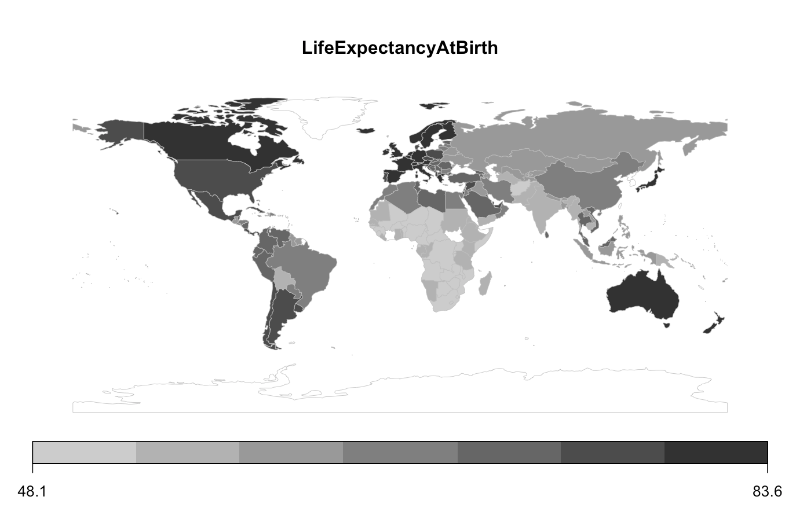
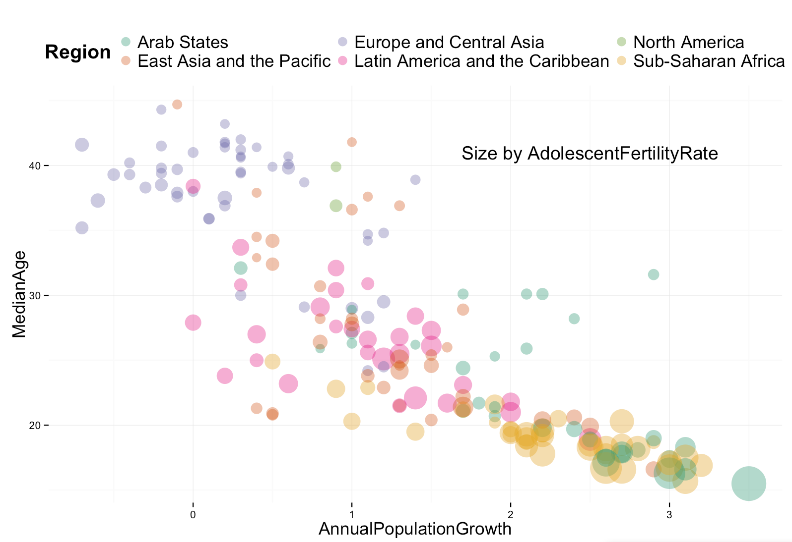
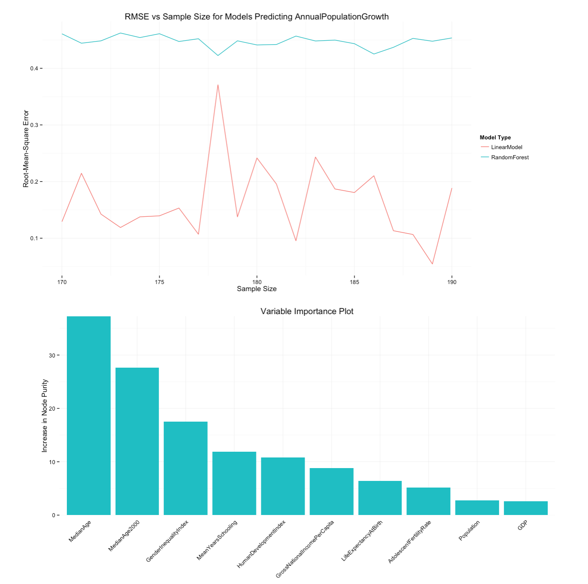
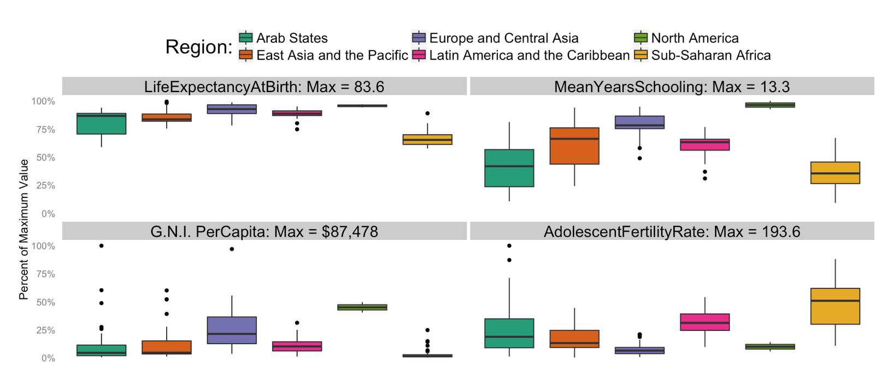

Final Project
==============================

| **Name**  | Conor O'Sullivan  |
|----------:|:-------------|
| **Email** | ccosullivan@dons.usfca.edu |

## Instructions ##

The following packages must be installed prior to running this code:

- `ggplot2`
- `shiny`
- `rworldmap`
- `randomForest`
- `reshape`


To run this code, please enter the following commands in R:

```
library(shiny)
shiny::runGitHub('msan622', 'conorosullivan', subdir='final_project')
```

This will start the `shiny` app. See below for details on how to interact with the visualization.

## Discussion ##



### Technique 1: Chloropleth

I used the rworldmap package to do my plotting. I merged my data with a current world map in their library and plotted the countries using a default Mercator projection. I used the raw data values because I liked how the legend for this plot shows the min and max values.  Using normalized values did not change the color intensity of the plot for any of the variables.

There is some lie factor in this visualization stemming from the fact that the colors are not in a smooth gradient. All of the possible plotting variables are continuous features however they do get bunched up as a result of there being only 7 possible shades of gray. Data-ink ratio is high in this plot, since we are simultaneously encoding location of the country along with the feature that is selected. The data density is medium here because of the fact that we are only encoding location and one variable. This could possibly be improved by adding a texture to each country dependent on a third variable, but I couldn't make this look attractive so I scrapped the idea. Another possibility is sizing the countries based on another feature, but I couldn't find this feature in any of the R packages I came across. One problem bringing the data density down is the fact that Antarctica and Greenland are plotted, despite having no data. Furthermore, I am lacking data for a few of the countries, like South Sudan, so they are plotted as empty white space on this plot.

The visualization is great at providing locational context to the variables of interest. We can clearly see that some of the worst off countries in the world are in the heart of Africa. In fact, many countries that are poorest and have the least years of schooling are right along the equator. While I wasn't able to include a continuous gradient like I mentioned earlier, the plot still does a good job at displaying the possible range of values with the different intensity of color.

I learned that while some countries have above average gross national income per capita, they for instance have low numbers of mean years of schooling. This is common among oil-rich countries in the middle east. While examining the middle east, it's interesting to note that Iraq and Afghanistan both have very high adolescent fertility rates along with high annual population growth, while most countries around them have much lower rates, with the exception of Saudi Arabia for population growth.

In South America, Argentina and Chile stand out as the most developed countries amongst the following variables: mean years of schooling, gross national income per capita, and life expectancy at birth. Argentina in particular has a strong European influence on the average way of life there, and this is reflected by its values amongst these variables. I think making country-specific conclusions like these are much easier when we have a map to point to and examine.



### Technique 2: Bubble Chart

I plotted this with geom_point in ggplot2. For the economics plot, I used the variables GDP, GrossNationalIncomePerCapita, and MeanYearsSchooling. I used the raw values of all of these variables. Likewise for the population growth plot, I used the raw values of AdolescentFertilityRate, MedianAge, and AnnualPopulationGrowth. I added the columns religion and region to the data.frame as well for this plot and the subsequent ones. For religion, I used the majority religion in the country and I used some predetermined categories from the original dataset for the regions. The graph also has a continuous color scale for the Human Development Index.

There is some lie factor in this plot as I changed the scale of the bubble size because it was hard to tell them apart initially. The fertility rates of most countries are pretty similar. Data-ink ratio on this plot is medium, since four variables are being shown simultaneously but I had to include a rather large legend and annotation to make sure the message was conveyed. Data density is high though, because of these four variables. It could be higher, still, if a fifth feature was added in the form of the shape of a point. 

The plot excels at showing the population and economics trends in this data. It's very easy to see that countries which exhibit a high fertility rate also show a lower median age and high population growth. These countries seem to be somewhat separated, geographically as well. Sub-Saharan Africa and the Arab States appear to have younger, faster growing populations while Europe and some parts of East Asia are older and declining in population. Also, we can clearly see that countries at the lower end of the population growth graph have lower human development index scores than ones on the upper end.

From this plot, I learned that China is a country with an average amount of schooling in the context of the world, but one of the highest GDPs (its bubble size is quite apparent). Furthermore we can see the UAE has a small GDP but a very high gross national income per capita due to its rich oil reserves.



### Technique 3: Line Graph and Bar Chart

I used the raw data values with this plot to create a linear regression and a random forest model. The line graph displays the root-mean-square error of both models after training the model on the rest of the variables listed. The bar chart displays the mean increase in node purity for a random forest splitting on the variables listed.

Lie factor here is 1 since I am directly plotting the values from the regression and random forest models on both graphs. Data-ink ratio is medium on the line graph since I am plotting the results of two models across two variables. It is slightly lower for the bar chart because the bars take up more ink and sample size is missing as a variable.I decided to make the bar charts blue here to match the color they had in the above line graph. Data density in these plots are lower than the above ones, but the simplicity of the bar chart here, while lowering data density, makes it still an attractive and informative chart.

The line graph excels at showing how for many of the variables, the random forest RMSEs are leaps and bounds lower than the linear model RMSEs. The bar chart gives us a perspective on the varying levels of interdependency of the variables that the bubble chart couldn't. For instance, mean years of schooling is best predicted by the human development index. However, the human development index is better predicted by gross national income per capita. Mean years of schooling, however, is not very well predicted by GNIPerCapita.



### Technique 4: Box Plot

I normalized the data for each of the 4 variables by dividing the variables by the maximum value. I did this to allow the facet_wrap() function to work since they have to be on the same scale. A positive side effect of this is that we can see how the clustering of certain variables is more widespread than others. For instance, LifeExpectancyAtBirth varies much less across the world compared to GrossNationalIncomePerCapita. 

Lie factor in this plot is quite low since the difference between the maximum and minimum values is much greater than what is displayed in the plot. Data-ink ratio is low because we have a lot of ink on the page. Between the notes displaying the maximum value, a duplicated y-axis and some rather heavy graphics, we have a busy looking plot here. However along with the large amount of ink, we are displaying a large amount of information. Reducing the amount of ink displayed any further was a tough challenge. Data density is high since we have four numeric variables displayed and two categorical variables that the user can switch between.

This visualization excels at comparing the distributions between different variables across a categorical variable. Furthermore we can see certain trends, for instance Sub-Saharan Africa (yellow) seems to be either among the highest values or lowest values for each box plot. From this visualization, I learned how much outliers in the GNIPerCapita skew the distribution when using normalized values. I was also surprised to see how some countries in the middle east have high fertility rates, however the countries in latin america on average have higher rates than the middle east.

### Interactivity

All of my plots involve some sort of brushing technique, whether we're brushing on the variable values that are being displayed or the category that the numerical variables are separated by. I included brushing with my chloropleth because keeping the map simple with one variable at a time provided the best looking plots. There was no attractive way for me to display all five variables at once. 

The bubble plot uses some multi-variable brushing to focus the viewer's attention. Providing too many variables as options for brushing could confuse the viewer and end up obfuscating the two different stories of economics and population growth that I'm displaying.

Instead of displaying 11 line graphs simultaneously for 11 different predictive models, I decided to build the models upon request and reduce overplotting. Furthermore, the viewer also gets added control over how the data is displayed by being able to change the number of training samples going into the model.

The brushing for the box plot gives a look at how different categorizations of countries greatly affect how we understand the distributions of those countries. When brushing by majority religion of a country, we can see that Islam and Christianity greatly resemble one another. When displaying region, however, these plots show how predominantly Christian areas, like Europe, are very different from Muslim areas. Brushing in this case avoided major over plotting issues by displaying half as many box plots at one time.

### Prototype Feedback

The original prototype I displayed had a bubble plot made in rCharts and some means of country data by a few different variables. The bubble plots looked great, but I couldn't get the colors to match the ggplot colors and I also couldn't display the country tooltips like I wanted to. The means were just not that informative and were eventually dropped.

I took Mong-Yun's advice to give up on rCharts. Were I to have more experience using JavaScript I would like to build my own bubble plots from scratch instead of using an R wrapper. I followed Dora's advice and made the bubble plot look as much like rCharts as I could. Anuj gave me some advice to drop the bar chart of mean values that I previously had, and I did. I went with the box plots instead and I think the viewer gains a lot more information because of it.

### Challenges

I found that implementing a world map in d3, despite many guides online, is still rather difficult. I originally transitioned from that to some map data found in ggplot2, but that provided me with an outdated map that included the USSR. I searched high and low for an alternative and eventually found rworldmap package as a good replacement.

I struggled with a third plot for a while; I was originally displaying a parallel coordinates plot instead of my variable prediction plots. I realized this gave me almost no more information than that bubble chart and decided to scrap it.

Like I said above, I really would have liked to implement the bubble plot in d3.