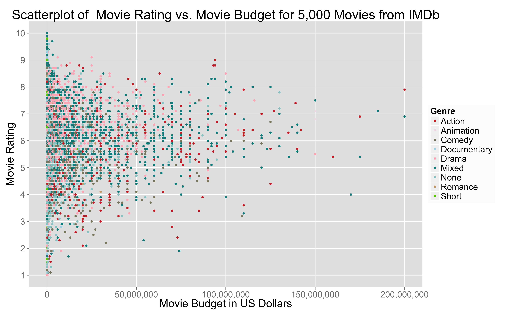
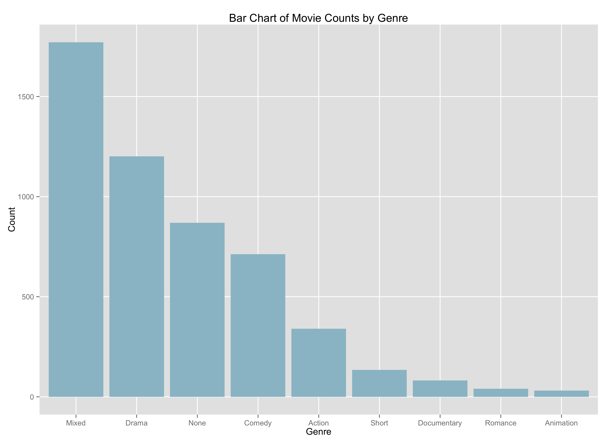
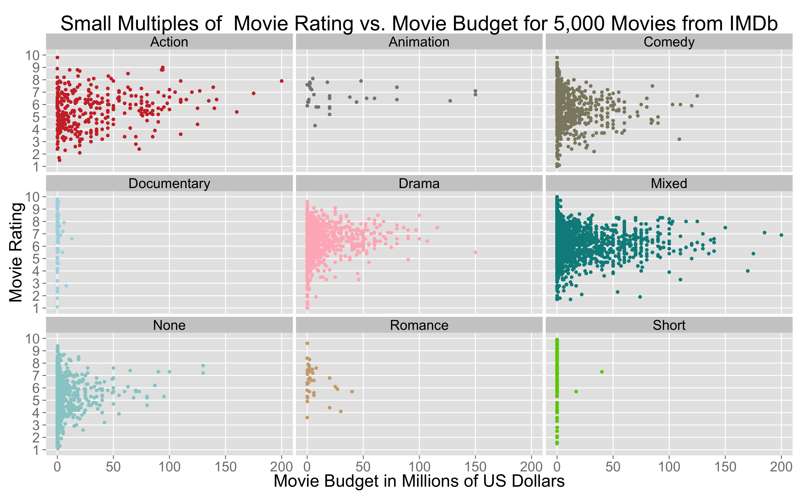
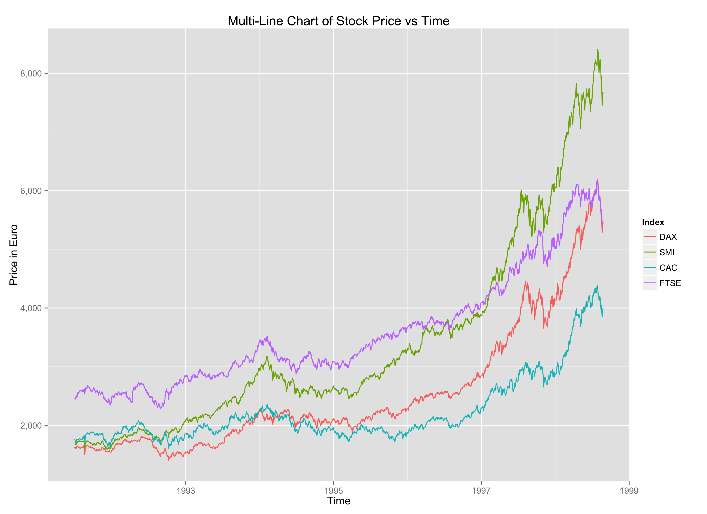

Homework 1: Basic Charts
==============================

| **Name**  | Conor O'Sullivan  |
|----------:|:-------------|
| **Email** | ccosullivan@dons.usfca.edu |

## Instructions ##

The following packages must be installed prior to running this code:

- `ggplot2`
- `reshape`
- `plyr`
- `scales`

Simply run homework1.r

This will generate 4 images.

## Discussion ##

#Scatterplot:

For this plot I tried to make the title quite descriptive, as it is hard to tell exactly how many points the user is looking at. I found a grey background to be a little easier on the eyes than white, which is what I usually use. I liked including the commas in the budgets, so 100,000,000 instead of 1e8.0. I also included every movie rating because the default was 0, 2.5, 5, 7.5, and 10 which was less helpful to understanding in this context. My thinking in choosing the colors was to differentiate the colors between Drama, Mixed, None, and Comedy as much as possible. They show up the most and the default colors that were assigned to these genres were so similar it was hard to tell them apart at first.

#Bar Chart:

I decided to order the bars from greatest to least instead of their first order, which was alphabetically by genre name. I then made them all the same color because I thought keeping the genre colors the same as the previous plot added no crucial information and was just distracting. I also removed the legend as well as the minor gridlines because neither of those were making the display more informative.

#Small Multiples Plot:

I decided to rescale the movie budgets by a factor of one million to improve the readability of the tick mark labels. Also, I removed the legend because the information it provides in this plot is redundant and unnecessary. I preferred the 3-by-3 symmetry of the rows and columns compared to the two rows of 5 graphs and 4 graphs. I would only have chosen 5 and 4 if I was keeping in the legend.

#Multiline Graph:

To graph this, I had to melt the data.frame and keep time as an ID variable. The reshape package is not suited for ts objects, so I had to unclass the time variable, melt on the unclassed variable, then reclass it as a time variable for the new data.frame. Once graphed, I kept the minor grid axes in this time as it shows the yearly trends that exist in the data. I relabeled the axes and the legend. I also added commas to the price.

#d3 Scatterplot:

I also made a scatterplot in d3 as a first experiment with Javascript. It was a really fun weekend project, you can view it here: http://bl.ocks.org/ConorOSullivan/
