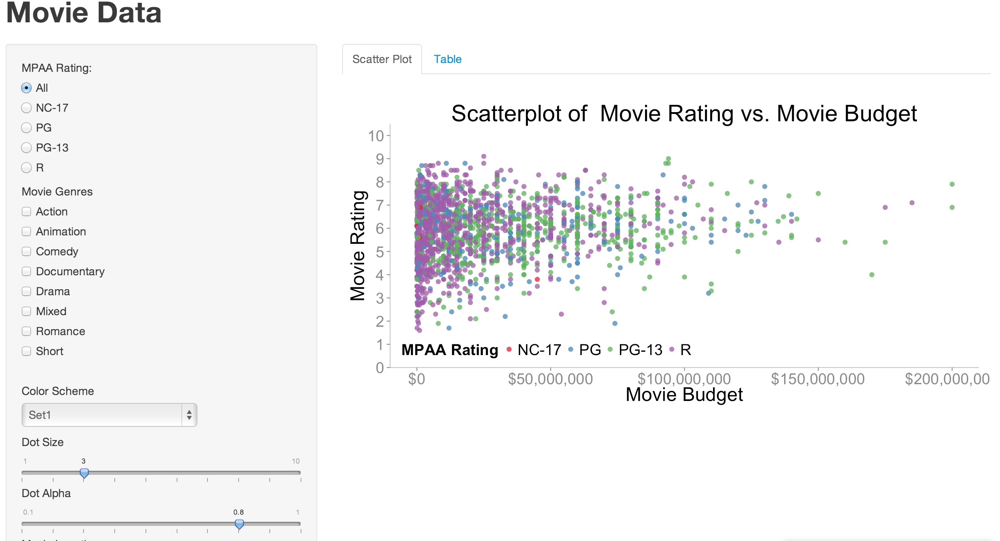

Homework 2: Interactivity
==============================

| **Name**  | Conor O'Sullivan  |
|----------:|:-------------|
| **Email** | ccosullivan@dons.usfca.edu |

## Instructions ##

The following packages must be installed prior to running this code:

- `ggplot2`
- `shiny`
- `scales`

To run this code, please enter the following commands in R:

```
library(shiny)
shiny::runGitHub('msan622', 'conorosullivan', subdir='homework2')
```

This will start the `shiny` app. See below for details on how to interact with the visualization.

## Discussion ##



This interactive shiny application visualizes data for 1800 movies taken from the "movies" dataset in R's ggplot2 package. The focus of the app is the scatterplot, which has budget on the y axis and rating on the x axis. The next tab is a table of the data being used to populate the plot.

The data can be subsetted by the checkboxes and radio buttons on the left panel. When any of these selections change, a reactive function in the shinyServer called changeFrame runs and re-subsets the data based on these selections.

Some plotting features are available: dot size, color scheme, dot alpha, use log axis. These selections are run through the getPlot function using their input values. I chose to include use log axis since many of the films were made on budgets between $1M and $100M. Using the normal axis devotes half of the plot to movies costing between $100M and $200M.

The points are colored by their MPAA rating. Making sure the colors stayed the same regardless of which points selected was initially quite a challenge. One solution that partially worked was saving the color palette for each of the color theme choices, then extracting only the colors of the currently selected ratings. This however was overly complicated compared with the code I published here. The limits= feature inside "scale_color_brewer" keeps the colors consistent regardless of what is displayed. If no data is available for the current selections, say NC-17 animated movies, a message is displayed saying so. This was achieved by an initial check on the length of the data.frame to be plotted.

The table updates with the subset selections, just like the plot. I also included the sort variable as an option as well as an option to have it in decreasing order or not.
