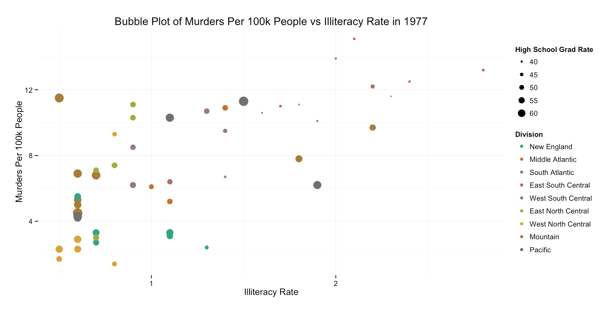
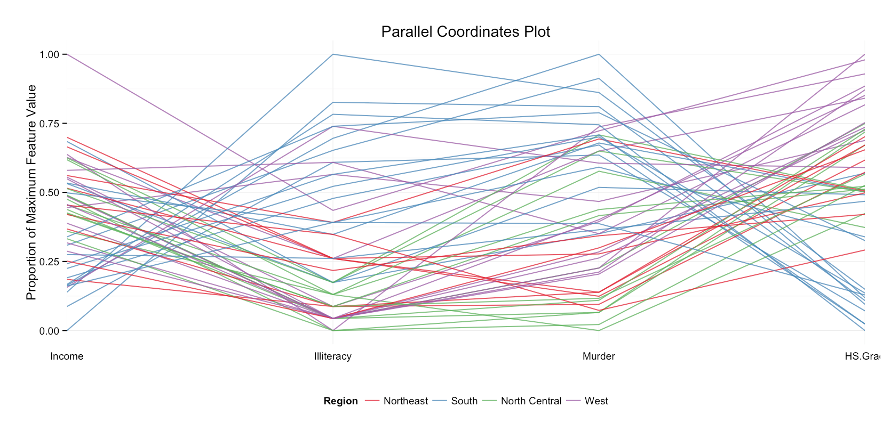
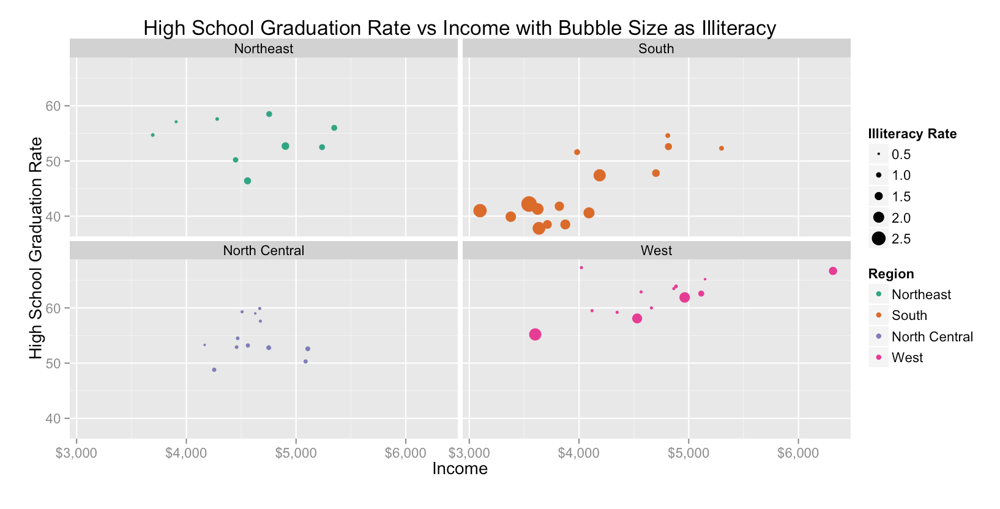

Homework 3: Multivariate
==============================

| **Name**  | Conor O'Sullivan  |
|----------:|:-------------|
| **Email** | ccosullivan@dons.usfca.edu |

## Instructions ##

The following packages must be installed prior to running this code:

- `ggplot2`
- `shiny`
- `scales`
- `RColorBrewer`

To run this code, please enter the following commands in R:

```
library(shiny)
shiny::runGitHub('msan622', 'conorosullivan', subdir='homework3')
```

This will start the `shiny` app. See below for details on how to interact with the visualization.

## Discussion ##



###Technique 1: Bubble Plot

I chose this technique because I liked how the size of bubbles added information. I included illiteracy rate, murders per 100,000 people, high school graduation rate, region, and division. I used region and division to encode the data across all of the plots. I tried using brushing to highlight certain points, which the user can select with the checkboxes on the left. This technique shows that illiteracy rate and graduation rate are positively correlated. As we go further right on the plot, the bubbles get smaller, giving us this conclusion. Furthermore, we can see that illiteracy and murder rate are also positively correlated too. The points corresponding to southern states occupy more of the upper-right area (indicating high illiteracy/murder) while northeast, north central states occupy the lower left of the plot.



###Technique 2: Parallel Coordinates Plot

I chose the parallel coordinates plot because I had never implemented it before and wanted to experiment with GGally's ggparcoord function. For this plot, the user has control over exactly which of the numeric variables they want to include. I had a problem in the beginning with the y-axis changing based on which of the regions/divisions were selected. The ggparcoord function uses the max and min of each variable to scale it between 1 and 0. If I remove certain regions or divisions, that changes the max and min and thus the entire look of the plot changes. A work around for this involved plotting every line every time, but using brushing to gray out the divisions/regions I'm currently not interested in. 

This method, however, prevented the use of a brushing feature that the other plots used. If you are coloring by region but then select which divisions you want to display, the parallel coordinates plot is unaffected. The bubble plot and small multiples plot, however, are brushed regardless of what the color scheme is currently selected to be. The ggparcoord function is found in the GGally package which has some different and more difficult to use functionality, which is the root cause of this problem.

From this plot, we can see that with the default variables selected, the northeast and north central regions exhibit very similar values for features like illiteracy and HS graduation rate. The south once again distinguishes itself here, especially for features like HS graduation rate	and illiteracy. By switching the axis order to Outlying, we can better expose regions and divisions that distinguish themselves from the rest of the pack.



###Technique 3: Small Multiples Plot

I chose a small multiples bubble plot as my final plot. I used the features high school graduation rate, division, region, illiteracy rate, and income. I found the bubble plot on the first tab to  have almost too much information in one page, and I wanted to see if I could better spot trends with the data spread out like this. The brushing from the first tab is still in effect here, so checking/unchecking regions and divisions will affect both plots (and the parallel coordinates plot too, given that the right 'Color By' choice is selected). We can see a positive correlation between income and high school graduation rate. Some entire divisions are sequestered in a small income bracket, East South Central, for instance. Other divisions are richer, like the Pacific. Something interesting is that while the Mountain division has almost the same income profile as the South Atlantic, high school graduation rates in the Mountain division are noticeably higher. Another observation is that the Pacific has a higher illiteracy rate overall than East North Central, however it also has a higher graduation rate. 


