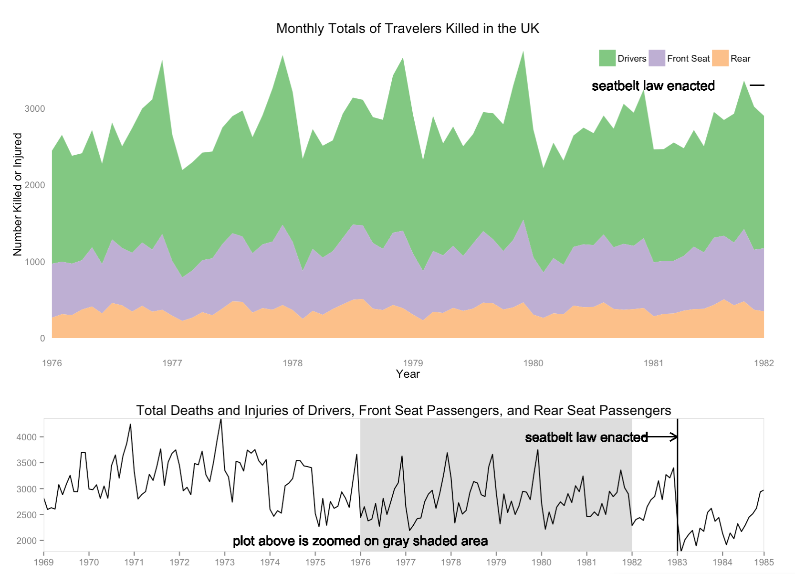

Homework 5: Text Data Visualization
==============================

| **Name**  | Conor O'Sullivan  |
|----------:|:-------------|
| **Email** | ccosullivan@dons.usfca.edu |

## Instructions ##

The following packages must be installed prior to running this code:

- `ggplot2`
- `shiny`
- `grid`
- `scales`


To run this code, please enter the following commands in R:

```
library(shiny)
shiny::runGitHub('msan622', 'conorosullivan', subdir='homework5')
```

This will start the `shiny` app. See below for details on how to interact with the visualization.

## Discussion ##



### Technique 1: Area Plot

I chose to create an area plot because I wanted to show the massive drop in monthly deaths that took place when the seatbelt law was enacted. I also decided to add more information by using the data's separation of driver, front seat passenger, and rear seat passenger deaths. The plot below the area plot is a line graph that gives context to what the area plot is currently showing. 

Interactivity:
The user can choose what span of years are being shown in the area graph, as well as which years are shaded in the context line graph, by using the slider on the left sidebar.

Customization:
- Made changes to the theme like legend position/justification, deleting grid marks and tick marks
- If the user selects the same year as the start and end point, a warning message is displayed
- Used RColorBrewer to set the color palette
- Added a line segment, text, and arrow on both graphs to show when the seatbelt law was enacted

Data-ink ratio: This plot has a moderately high data-ink ratio, since I've removed extraneous gridmarks and tick marks. However, there is some text written on the plots themselves that I've kept in order to explain certain pieces of information that I felt were worth explaining.  
Lie factor: Lie factor on this is 1 since the numbers are not distorted.  
Data density: This plot has a moderate data density. The area plot itself takes up a lot of space, and while it shows three different classes of auto passenger as well as when the law was enacted, it is still clear that this is not the densest visualization.


### Technique 2: Multi-Line

I chose a multi-line plot in order to better show the seasonality of the data.

Interactivity:
The same year preferences the user selected on the area plot tab apply here.

Customization:
- Shortened and formatted month names
- Used color brewer to choose color scale
- Gray out years that aren't selected
- Removed grid lines and tick marks
- Used white background

Data-ink ratio: This plot has a higher data-ink ratio than the area plot. It shows the year-on-year seasonality that certain months have better than the area plot does. For instance, the colder months of the year exhibit a higher total death rate per month than the summer months. This can be seen to be true year after year.  
Lie factor: There is a lie factor of 1 in this plot. No misrepresenation of the numbers here.
Data density: This plot is also moderately data-dense. Here we can only see total deaths, but the months are easier to distinguish than the area plot before, so we get some explanatory power out of that fact. It wasn't easy to display when the seatbelt law came into effect, so I left that part out, resulting in less data density than before.

